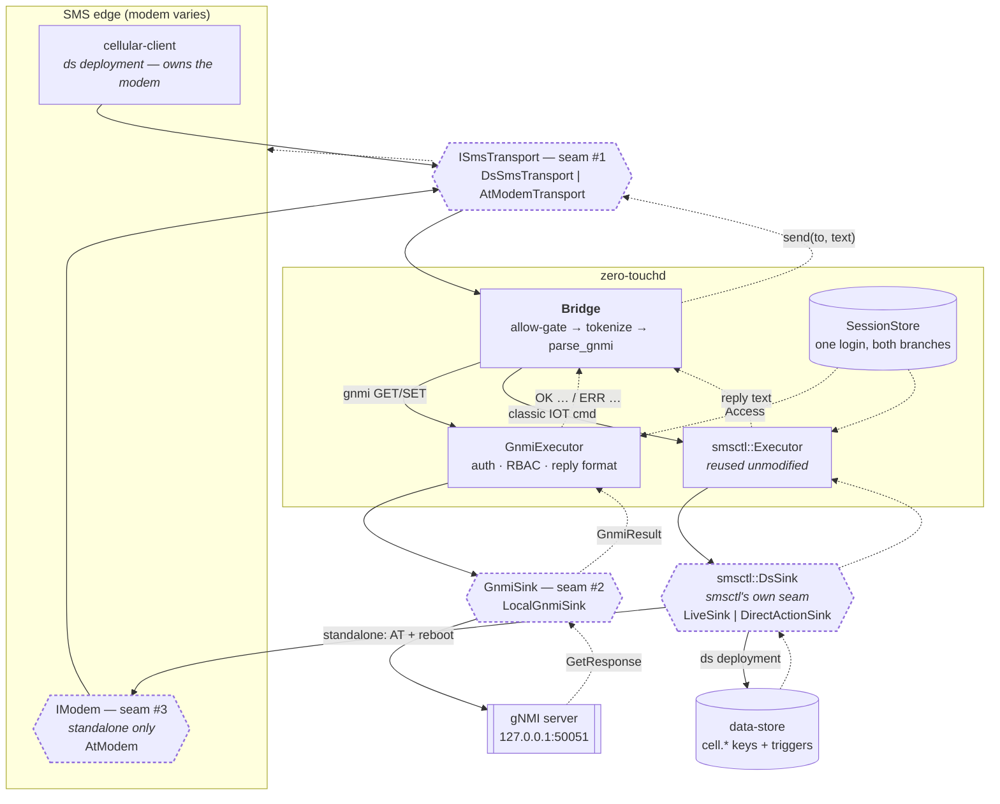
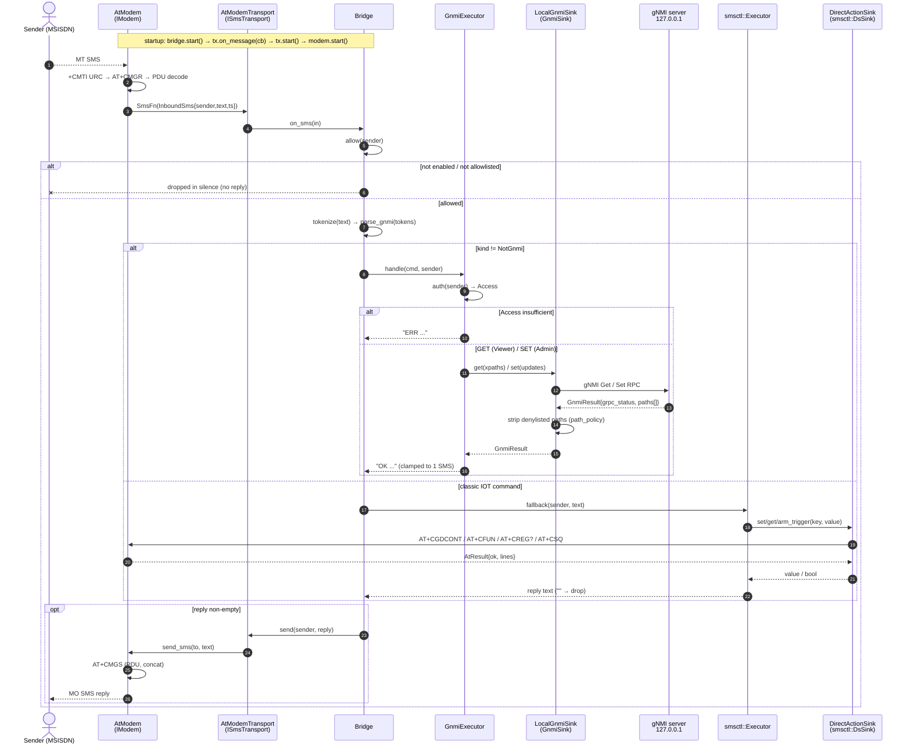

# zero-touch — SMS-driven gNMI provisioning bridge

zero-touch lets an operator configure and query a field device entirely over
SMS. An inbound `IOT GNMI GET/SET …` message is authenticated, translated into a
gNMI `Get`/`Set` RPC against the **device-local** gNMI server, and the result is
returned as a reply SMS to the original sender.

It is an *integrator*: it reuses the `smsctl` command engine from the **iot**
repo and the `gnmi_client`/`gnmi_util` from the **grace-server** repo, both
pulled in as git submodules and **never modified**.

## Two deployment shapes, one set of seams

The same command engine and interface seams drive two daemons — pick per device:

- **`zero-touchd` (integrated)** — rides an existing iot stack: SMS via
  cellular-client, config/users/telemetry via ds-server. Sections up to
  [Standalone appliance](#standalone-appliance-ds-free) describe this.
- **`zero-touchd-standalone` (ds-free)** — one self-contained daemon: opens the
  modem directly (AT) and reads config/users from files. No ds-server, no
  cellular-client. See [Standalone appliance](#standalone-appliance-ds-free).

Both select their backends behind the **same three seams** — `ISmsTransport`
(SMS), `GnmiSink` (gNMI), and `IModem` (the AT modem, standalone only) — so the
API stays fixed while the concrete model varies.

## Goals

- Stable command surfaces (`ISmsTransport`, `GnmiSink`, `IModem`) while the
  concrete model behind each — the modem, the gNMI backend — can change.
  Interface design pattern, maximum reuse.
- Add a `gnmi` command **without editing** iot's `smsctl` parser.
- Unified authentication: a single `IOT LOGIN` authorises both the classic
  smsctl commands and the new gnmi commands (one shared `SessionStore`).

## Architecture

Solid = request, dashed = response. The dashed-outline blocks are the seams —
the only places a concrete model is chosen.



Three zero-touch seams (`ISmsTransport`, `GnmiSink`, `IModem`) plus smsctl's own
`DsSink`, and one shared engine reused unmodified.

Two things the picture is meant to settle:

- **The data store is not in the gNMI path.** In the ds deployment ds serves
  three *separate* roles — SMS transport (`sms.last.*` / `sms.send.*`), config +
  accounts (`zerotouch.*`), and the action backend for the **classic** commands
  (`LiveSink`). The gnmi branch touches none of it: `Bridge → GnmiExecutor →
  LocalGnmiSink → 127.0.0.1`. The two branches are siblings off the Bridge, not
  a chain.
- **`IModem` is shared.** On a standalone box the same AT channel carries SMS
  (via `AtModemTransport`) and the classic actions (via `DirectActionSink`);
  implementations serialise it so the two never interleave.

### Response path

Both branches converge on the same return path — that is the point of the split.
`LocalGnmiSink` decodes the `GetResponse` into `GnmiResult` rows (denylisted
paths already carry `sensitive path denied`, never a value) and `GnmiExecutor`
renders `OK …` / `ERR …` clamped to one SMS; on the other side `smsctl::Executor`
renders its own reply text. Both hand a `std::string` back to `Bridge::on_sms`,
which applies one rule: **empty string → send nothing** (the silent-drop contract
for `NotACommand` and disallowed senders, so the device is not an oracle). A
non-empty reply goes out `ISmsTransport::send`, back through the modem it arrived
on — `AT+CMGS` standalone, `sms.send.*` + request bump on ds.

### Message flow

One inbound SMS, end to end, in the **standalone** wiring (`AtModem` +
`DirectActionSink`). The ds-backed daemon is the same sequence with
`DsSmsTransport` in place of `AtModemTransport` and `smsctl::DsSink` writing ds
keys instead of `DirectActionSink` driving AT.



### Why zero-touchd replaces iot-smsctld on the device

`smsctl`'s `Kind` enum is fixed in the iot repo, and we keep iot untouched. So
we do **not** teach smsctl's parser about gnmi. Instead `zero-touchd` is the
single SMS-control daemon that:

- reuses `smsctl::tokenize`, `smsctl::SessionStore` (+ `AccountLookup`) and
  `smsctl::Executor` (via its `DsSink`) as a **library** for the classic
  commands (LOGIN / STATUS / APN / WIFI / REBOOT / …),
- adds its **own** gnmi command layer on top,
- shares **one** `SessionStore` so a single login authorises everything.

Run `zero-touchd` in place of `iot-smsctld`; iot source is consumed as a
submodule, never modified.

## Interfaces

### ISmsTransport — the "any modem" seam

```cpp
struct InboundSms { std::string sender, text, ts; };

struct ISmsTransport {
  virtual ~ISmsTransport() = default;
  virtual void on_message(std::function<void(const InboundSms&)>) = 0; // MT in
  virtual bool send(const std::string& to, const std::string& text) = 0; // MO out
  virtual void start() = 0;                                             // join reactor
};
```

- **DsSmsTransport** (impl #1, built now): watches the `sms.last.*` ds keys that
  `cellular-client` publishes and writes replies to `sms.send.{to,text,request}`
  — a refactor of iot's existing `smsctl_client` drain/publish logic behind the
  interface. Preserves today's ds/cellular route unchanged.
- Future impls (interface stays the same): `AtModemTransport` (direct
  AT/PDU via `wan/cellular`'s `SerialChannel` + `sms_receiver`),
  `SmppTransport`, `CloudApiTransport`.
- **MockTransport** for host tests.

### GnmiSink — the gNMI backend seam

```cpp
struct GnmiPathResult { std::string xpath, value, error; };
struct GnmiResult {
  bool ok = false;
  int  grpc_status = -1;
  std::string grpc_message;
  std::vector<GnmiPathResult> paths;   // GET: values; SET: per-update status
};

struct GnmiSink {
  virtual ~GnmiSink() = default;
  virtual GnmiResult get(const std::vector<std::string>& xpaths) = 0;
  virtual GnmiResult set(
      const std::vector<std::pair<std::string,std::string>>& updates) = 0;
};
```

- **LocalGnmiSink** (built now): builds `gnmi::GetRequest`/`SetRequest` with
  grace-server's `gnmi_util::parse_yang_path`, calls `gnmi_client::call(
  "127.0.0.1", port, …)`, decodes the response. Enforces a **sensitive-path
  denylist** so a GET cannot exfiltrate credentials over plaintext SMS even when
  Admin-gated.
- **MockGnmiSink** for host tests.

### IModem — the AT-modem seam (standalone only)

The standalone appliance owns the modem's AT channel directly. One `IModem`
serves both the SMS transport and the classic-command backend, so a single
serial port is shared without contention.

```cpp
struct AtResult { bool ok; std::vector<std::string> lines; /* line_with(prefix) */ };
struct IModem {
  virtual AtResult at(const std::string& cmd) = 0;                    // command
  virtual bool     send_sms(const std::string& to, const std::string& text) = 0;
  virtual void     on_sms(std::function<void(const InboundSms&)>) = 0;// inbound
  virtual void     start() = 0;                                       // open + poll
};
```

- **AtModem** — generic 3GPP (27.005/27.007) driver: POSIX serial + a synchronous
  AT engine + an ACE timer that polls SIM/ME storage (`AT+CMGL`, PDU mode). PDU
  codec + reassembly are **reused verbatim** from iot `wan/cellular`
  (`encode_sms_submit`/`decode_sms_deliver`/`SmsReassembler`); the init/send flow
  mirrors the tested WP7702 cellular-client (startup ESC, `CMGF=0`,
  `CNMI=2,1,0,0,0`, no `CPMS`). Vendor-aware: forced by config or auto-detected
  via `AT+GMI`/`AT+CGMM` → the reused `cellular::parse_vendor`.
- **`make_modem(AppConfig)`** — the config-driven factory (the wiring point +
  the seam where a future non-AT transport, e.g. cloud SMS/SMPP, would branch).
  `modem.type = auto | sierra | quectel | ublox | generic` (WP7702 = Sierra).
- **MockModem** for host tests (scripts AT responses; drives everything above the
  serial layer).

## Standalone appliance (ds-free)

`zero-touchd-standalone` runs the same engine with different backends behind the
seams — no ds-server, no cellular-client:

```
   AT modem ◀──▶ IModem (one AT channel) ◀── make_modem(config)
                    ▲                 ▲
          AtModemTransport      DirectActionSink (DsSink)
                    │                 │
                    └──── Bridge ─────┴── smsctl::Executor  (classic cmds)
                           │  tokenize/parse/session (reused)
                      GnmiExecutor ──▶ LocalGnmiSink ──▶ 127.0.0.1 gNMI
   config file (enabled, gnmi.port, allowed, modem.dev/baud/type)
   users file  (id:sha256:access)     ← replaces auth.users.*
```

What swaps, all behind the existing seams:

| Concern | integrated | standalone |
|---|---|---|
| SMS transport | `DsSmsTransport` (ds `sms.*`) | **`AtModemTransport`** over `IModem` |
| classic backend | `LiveSink` → ds → iot daemons | **`DirectActionSink`** → AT / syscalls |
| config | `zerotouch.*` ds keys | **config file** (`parse_config`) |
| users | `auth.users.*` ds keys | **users file** (`UserStore`) |
| gNMI / auth / sessions | `LocalGnmiSink`, `SessionStore` | **unchanged** |

- **`DirectActionSink : smsctl::DsSink`** — lets `smsctl::Executor` be reused
  verbatim while the classic commands act directly:
  `APN`→`AT+CGDCONT`, `cell.reset`→`AT+CFUN` cycle, `STATUS`→`AT+CREG/CSQ/CGPADDR`,
  reboot→syscall. `WIFI`/`FACTORY-RESET` are rejected at the daemon (no iot
  daemon backs them).
- **Config/users are files**, not ds; **sessions/nonces stay in-memory**.

## Command grammar (zero-touch layer)

```
IOT GNMI GET <xpath[,xpath...]>
IOT GNMI SET <xpath[,xpath...]> <value[,value...]>   # positional pairing
```

- Reuses `smsctl::tokenize` (quoting / escapes already handled).
- `GNMI GET` → non-mutating → a valid session (Viewer OK).
- `GNMI SET` → mutating → **Admin** session required.
- `SET` xpath and value lists must have equal length; mismatch → `ERR`.
- Replies pass through `smsctl::clamp_reply` (one GSM-7 SMS):
  - `OK GNMI GET /p=val; /p2=val2`
  - `OK GNMI SET n path(s) updated`
  - `ERR GNMI SET <grpc-message>`
- Values are never echoed for sensitive paths; errors never leak argument values.

## Security

- SMS sender IDs are spoofable → the password/session is the gate, not the
  MSISDN (same posture as smsctl). `GNMI SET` requires Admin.
- Sensitive-path denylist in `LocalGnmiSink` blunts GET-based secret exfil.
- Replay baseline at startup (reuse smsctl's `m_seen_*` guard) so SMS already in
  SIM storage cannot execute on boot.
- Sender allowlist + brute-force lockout inherited from `SessionStore`.
- gNMI target is pinned to `127.0.0.1:<gnmi.local.port>`; never taken from SMS.

## Dependencies

- **iot** submodule → `smsctl::core` (`add_subdirectory` the `modules/smsctl`
  path). Pulls OpenSSL; ACE only for the daemon/DsSmsTransport.
- **grace-server** submodule → `gnmi_client` + `gnmi_util` + `idl/gnmi/gnmi.proto`.
  This client is libevent-based (`framework.hpp`, `tls_config`); we reuse it
  verbatim (max reuse) and isolate it behind `LocalGnmiSink` so it can be
  swapped for a plain `grpc++` stub later without touching the engine.

## Phases

1. **Scaffold** — repo, CMake, submodules, CI. Verify smsctl + gnmi_client build here.
2. **Interfaces + mocks** — `ISmsTransport`, `GnmiSink`, `MockTransport`, `MockGnmiSink`. Pure, host-tested.
3. **gNMI command layer** — parser (GET/SET grammar, count-mismatch), executor (auth via shared `SessionStore`, request-building via `gnmi_util`), reply formatter. Tests vs `MockGnmiSink`.
4. **LocalGnmiSink** — real `gnmi_client::call()` to `127.0.0.1:<port>`, decode `GetResponse`/`SetResponse`, denylist.
5. **DsSmsTransport** — port `smsctl_client`'s ds watch/drain/publish behind the interface.
6. **zero-touchd** — compose shared `SessionStore` + `smsctl::Executor` + gnmi layer + transport on the ACE reactor. Config keys (hot-applied): `zerotouch.enabled` (ships false), `zerotouch.gnmi.port`, `zerotouch.allowed.numbers`, `zerotouch.session.ttl.sec`, `zerotouch.lockout.{failures,sec}`. A single `IOT LOGIN` (against `auth.users.*`) authorises both gnmi and classic commands; a disabled or non-allowlisted sender is dropped in silence.
7. **Packaging** — systemd unit, ds schema (`zerotouch.lua`), DEPLOY notes.
