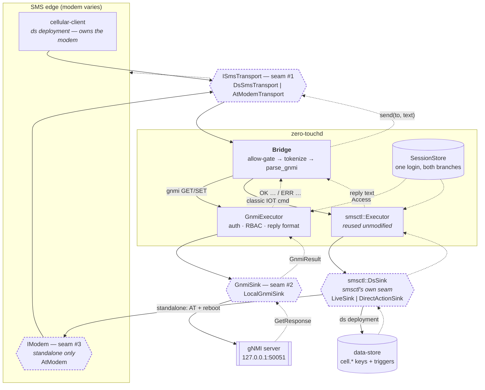
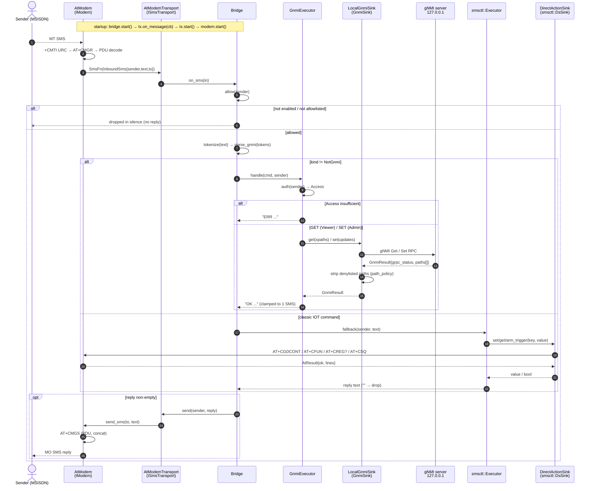

# zero-touch

SMS-driven **gNMI** provisioning for field devices. An operator texts

```
IOT GNMI GET /system/config/hostname
IOT GNMI SET /system/config/hostname router-7,/interfaces/interface[name=eth0]/config/enabled true
```

the daemon authenticates the sender, runs the corresponding gNMI `Get`/`Set`
against the **device-local** gNMI server, and replies over SMS.

It is an integrator: it reuses the `smsctl` engine (from **iot**) and the
`gnmi_client` (from **grace-server**) as git submodules, both unmodified.

## Two deployment shapes, one set of seams

- **`zero-touchd` (integrated)** — rides an existing iot stack: SMS via
  cellular-client, config/users/telemetry via ds-server.
- **`zero-touchd-standalone` (ds-free)** — one self-contained daemon: opens the
  modem directly (AT) and reads config/users from files. No ds-server, no
  cellular-client — for a device that runs only a gNMI server.

Both select their backends behind the same three seams — `ISmsTransport` (SMS),
`GnmiSink` (gNMI), `IModem` (the AT modem, standalone) — so the API stays fixed
while the model varies. `modem.type` selects the vendor (`auto` detects it;
WP7702 = Sierra).

See [DESIGN.md](DESIGN.md) for the architecture and [DEPLOY.md](DEPLOY.md) for
deploying either daemon on a device.

## Architecture

Solid = request, dashed = response. The dashed-outline blocks are the seams —
the only places a concrete model is chosen.



The gnmi and classic branches are **siblings off the `Bridge`, not a chain** —
the data store is not in the gnmi path. On a standalone box `IModem` is shared:
the same serialised AT channel carries SMS (`AtModemTransport`) and the classic
actions (`DirectActionSink`).

### Message flow

One inbound SMS end to end, in the **standalone** wiring. The ds-backed daemon is
the same sequence with `DsSmsTransport` in place of `AtModemTransport` and
`LiveSink` writing ds keys instead of `DirectActionSink` driving AT.



Both branches converge on one return path, and `Bridge::on_sms` applies a single
rule: **empty reply → send nothing** — the silent-drop contract that keeps the
device from being an oracle. Full walkthrough in
[DESIGN.md](DESIGN.md#architecture).

## Layout

```
inc/zerotouch/   ISmsTransport, GnmiSink, IModem + command layer   (the seams)
src/             gnmi command layer + transport/sink/modem impls
daemon/          zero-touchd (integrated) + zero-touchd-standalone
sim/             zerotouch-sim — offline SMS simulator (no modem/ds/gRPC)
test/            host tests (mocks: no modem, no ds, no gRPC)
schemas/         zerotouch.lua — ds key schema (integrated)
packaging/       systemd units + SysV init + env / config / users files
third_party/     iot, grace-server (submodules)
```

## Try it offline — `zerotouch-sim`

`zerotouch-sim` **bypasses the SMS transport**: it wires the **real** `Bridge`
(smsctl parser/session/executor + the zerotouch gnmi layer) behind an in-process
console transport, so each line you type lands straight at `Bridge::on_sms` — no
modem, no ds-server, no gRPC (the gNMI backend is an in-memory tree).

Run it in its container (a **SIM** banner shows on entry):

```sh
./sim.sh                    # builds the zerotouch-sim image if needed, then runs it
./sim.sh --rebuild          # force a fresh image
./sim.sh sh                 # drop into a shell in the container instead
# native (no Docker): cmake -S . -B build -DZT_BUILD_SIM=ON && ./build/zerotouch-sim
```

```
$ ./sim.sh
   ____ ___ __  __
  / ___|_ _|  \/  |
  \___ \| || |\/| |
   ___) | || |  | |
  |____/___|_|  |_|
  zero-touch offline simulator  —  no modem / ds-server / gRPC
> IOT LOGIN admin admin
  ← SMS to +15551230000: OK LOGIN: admin, 10 min
> IOT GNMI GET /system/config/hostname,/system/aaa/user[name=admin]/config/password
  ← SMS to +15551230000: OK GNMI GET /system/config/hostname=demo-router; /system/aaa/user[name=admin]/config/password=<sensitive path denied>
> IOT GNMI SET /system/config/hostname router-7
  ← SMS to +15551230000: OK GNMI SET 1 path(s) updated
```

`/help` lists the REPL commands (`/from`, `/enable`, `/disable`, `/allow`,
`/tree`, `/users`).

## Build (host tests)

```sh
git submodule update --init --recursive
cmake -S . -B build -DZT_BUILD_TESTS=ON
cmake --build build
ctest --test-dir build
```

The pure command layer + tests need only a C++17 compiler (GTest is fetched if
absent). `LocalGnmiSink` — the real gNMI backend over grace-server's
`gnmi_client` — is opt-in and needs protobuf, libevent, libevent_openssl and
nghttp2 (the device/Yocto toolchain has these):

```sh
cmake -S . -B build -DZT_BUILD_GNMI=ON
```

`DsSmsTransport` — the ds/cellular-client SMS route (impl #1 of `ISmsTransport`)
— is likewise opt-in and needs ACE + the reused `datastore_client` (and its Lua
/ OpenSSL deps), all provided by the device/Yocto toolchain:

```sh
cmake -S . -B build -DZT_BUILD_DS=ON
```

`-DZT_BUILD_DAEMON=ON` implies both `ZT_BUILD_GNMI` and `ZT_BUILD_DS`. The
**standalone** appliance (`zero-touchd-standalone`, ds-free — `AtModem` +
config/users files) builds with `-DZT_BUILD_STANDALONE=ON` (implies gNMI, needs
ACE; no ds):

```sh
cmake -S . -B build -DZT_BUILD_STANDALONE=ON
```

To cross-compile the daemon for an **aarch64 (ARMv8-A)** device, use `build.sh`
with a Yocto SDK or a cross toolchain + sysroot. The device rootfs is read-only,
so production installs bake the daemon into the image via a Yocto recipe
(`packaging/yocto/`) — see
[DEPLOY.md](DEPLOY.md#deploy-to-the-device-read-only-rootfs):

```sh
./build.sh --sdk /opt/poky/<ver>/environment-setup-cortexa53-crypto-poky-linux
```

Add `--standalone` for the ds-free appliance
(`./build.sh --standalone --sdk …` → `zero-touchd-standalone-aarch64.tar.gz`).

No cross toolchain handy? `./docker-build.sh` builds the aarch64 SysV deploy
tarball in a container (native arm64 via QEMU) and drops
`zero-touchd-aarch64-sysv.tar.gz` in the current directory. The standalone image
has its own `Dockerfile.standalone`.
