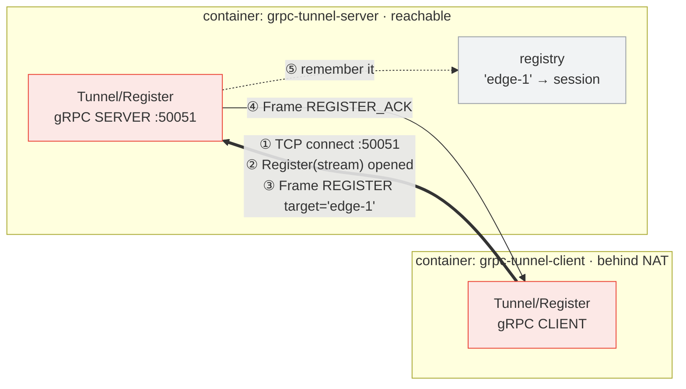
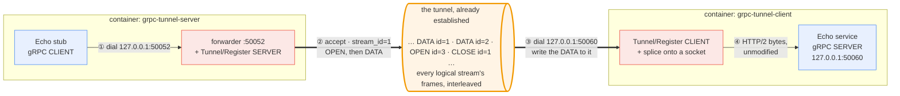
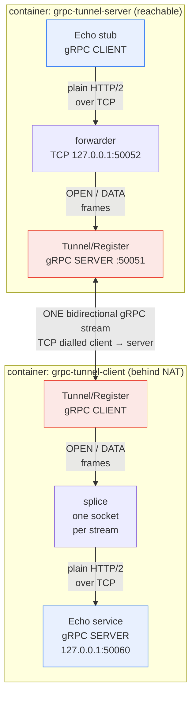
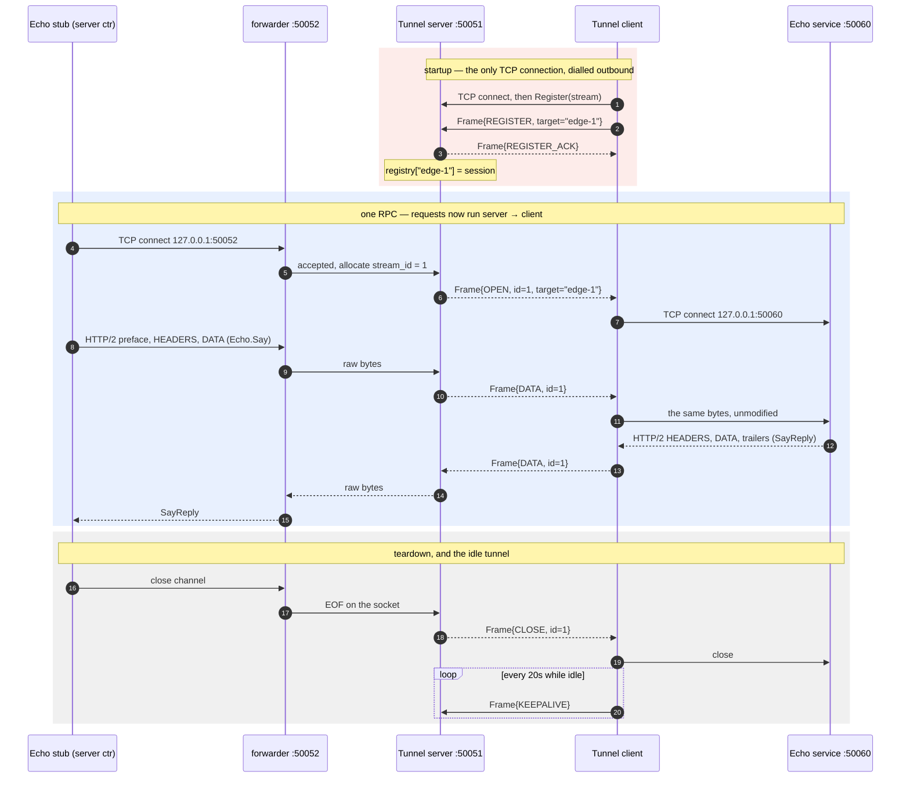

# grpc-tunnel

A reverse gRPC tunnel in C++: **gRPC carried inside gRPC**, so a service that
has no inbound port can still be called.

Two containers:

| container | has a reachable address | runs a gRPC **server** | runs a gRPC **client** |
|---|---|---|---|
| `grpc-tunnel-server` | yes | `Tunnel/Register` — accepts the dial-in | `Echo` — calls the *other* container |
| `grpc-tunnel-client` | no (behind NAT) | `Echo` — on loopback only | `Tunnel/Register` — dials out |

Both ends are a client *and* a server at once, and they are mirror images of
each other. That is the whole idea.

The protocol itself is written up separately in **[`SPEC.md`](SPEC.md)** —
frame-by-frame flow, state machines, ordering rules and prior art. This page is
the tour; that one is the reference.

## The problem it solves

A device in the field can reach a cloud endpoint, but nothing can reach the
device: NAT, a firewall, or a carrier-grade address in between. The usual
answer is polling. A tunnel keeps the direction of *connection setup* and the
direction of *requests* separate:

* the **TCP connection** is opened client → server, outbound, like any other
  call it already makes;
* the **RPCs** then flow server → client, down that same connection.

## Architecture

### 1 · Establishing the tunnel

Nothing can reach the client, so the client goes first. This is the only TCP
connection in the system, and it is opened in the direction NAT already allows.



The `Register` call is long-lived — it is held open for the life of the process,
and the stream it returns *is* the tunnel. Only after ④ does the server have
anywhere to send a request. If the stream ever breaks the client redials and
re-registers, every few seconds, forever.

### 2 · Packets inside the established tunnel

Now the direction reverses. Requests run server → client, down the connection
the client opened.



The server's app dials a plain local port (①); the forwarder accepts that
socket, allocates a `stream_id` and announces it with `OPEN` (②); the client
dials the real service and splices the two together (③④). The reply retraces
the same path in reverse over the same `stream_id`.

Note what is inside the pipe: frames belonging to *different* logical streams,
interleaved. One tunnel carries every concurrent connection, `stream_id` telling
them apart — `Session` in `src/session.cc` is the multiplexer that does it.

### The three connections

The diagrams above are easy to misread as "the tunnel dials out to something".
It does not. After phase 1, **no further TCP connection ever crosses the
network.** Every connection opened afterwards is loopback, inside one
container.

Captured live from `/proc/net/tcp`, with two RPCs in flight at once:

```text
=== server container ===                  === client container ===
LOOPBACK  127.0.0.1:33912 -> :50052       LOOPBACK  127.0.0.1:37632 -> :50060
LOOPBACK  127.0.0.1:34892 -> :50052       LOOPBACK  127.0.0.1:49186 -> :50060
NETWORK   10.89.0.2:50051 <-------------------------> 10.89.0.3:51144
```

Two concurrent calls created two new loopback connections *in each container* —
and the count of connections crossing the network stayed at **one**. That is
the whole mechanism, in one picture.

To see it yourself while the containers are running (ports are hex in there:
50051 is `c383`, 50052 `c384`, 50060 `c38c`):

```sh
podman exec grpc-tunnel-server cat /proc/net/tcp    # the loopback pairs
podman exec grpc-tunnel-server cat /proc/net/tcp6   # the tunnel itself
```

#### Why there are loopback sockets at all

gRPC C++ has no pluggable transport — a stub cannot be handed a tunnel and told
to write into it. It can only talk to a **socket**. So each side gives it an
ordinary local one and relays the bytes: the forwarder on `127.0.0.1:50052` for
the server's stub to dial, and the Echo service on `127.0.0.1:50060` for the
tunnel client to dial. Neither port is reachable from outside its container.

#### One RPC, followed socket by socket

| step | what happens | socket |
|---|---|---|
| 1 | the app's stub dials the forwarder | new loopback `33912 → 50052` |
| 2 | forwarder accepts, allocates `stream_id=1`, sends `OPEN` | the network connection |
| 3 | tunnel client gets `OPEN`, dials its Echo service | new loopback `37632 → 50060` |
| 4 | stub writes HTTP/2 preface, HEADERS, DATA | into `33912` |
| 5 | forwarder reads those bytes, wraps them as `DATA id=1` | the network connection |
| 6 | tunnel client writes the bytes out verbatim | into `37632` |
| 7 | Echo service reads a perfectly ordinary HTTP/2 stream | off `50060` |

The reply retraces 7→4. Steps 5–6 are a byte relay: nothing is decoded and
nothing is re-encoded.

#### There is only ever one `Register` call

The tunnel does **not** make a gRPC call per application RPC. It makes exactly
one — `Register` — at startup, and holds it open for the life of the process.
Every RPC afterwards is `Frame` messages on that one already-open call. This is
why a second concurrent call dials nothing across the network: the server
allocates `stream_id=2`, and its frames simply interleave with stream 1's.

### Components



Blue is the application — it is written as if the two halves were on the same
LAN. Red is the tunnel. The application never includes a tunnel header; the
only thing it is told is a different `host:port` to dial.

### Why a byte splice, not a proto re-encode

Each logical stream is **one TCP connection spliced onto the tunnel**, so what
travels inside the `DATA` frames is untouched HTTP/2 — a complete second gRPC
session nested in the first. The tunnel never parses a method name, a header,
or a message. That is what lets it carry unary *and* streaming RPCs, deadlines,
status codes and trailers without knowing they exist, and it is why swapping
`Echo` for any other service needs no change to the tunnel at all.

## Message sequence



A gRPC channel is long-lived, so steps 6–8 happen **once per channel**, not
once per RPC: further calls reuse `stream_id = 1`. The `--auto` mode below
shows four RPCs sharing a single tunnel stream.

## The frame protocol

`proto/tunnel.proto` is the entire wire format:

| type | direction | meaning |
|---|---|---|
| `REGISTER` | client → server | "I can serve `target`" |
| `REGISTER_ACK` | server → client | registered |
| `OPEN` | server → client | open logical stream `stream_id` |
| `DATA` | either | payload bytes for `stream_id` (32 KiB chunks) |
| `CLOSE` | either | `stream_id` finished, `error` set if it failed |
| `KEEPALIVE` | client → server | hold NAT state open |

`stream_id` is allocated by the server, because the server is the only side
that opens streams. Frames for different streams interleave freely on the one
gRPC stream; `Session` (in `src/session.cc`) is the multiplexer.

**→ [`SPEC.md`](SPEC.md) is the full protocol specification**: which fields are
valid per frame type, session and stream state machines, the exact frame
sequence for a unary RPC and for concurrent streams, the ordering and
concurrency rules, every failure case, and how this compares with
[openconfig/grpctunnel](https://github.com/openconfig/grpctunnel).

## Running it

Requires **podman** or **docker** — `run.sh` prefers podman when both are
installed, and `CONTAINER_ENGINE=docker` forces the other. Nothing is built on
the host; the image carries gRPC 1.51 and protobuf 3.21 from Debian bookworm
packages, so it builds in about a minute.

```sh
./run.sh build           # detect engine, build grpc-tunnel:local
```

Then, in three terminals:

```sh
./run.sh server          # terminal 1 — the reachable side
./run.sh client          # terminal 2 — the side behind NAT
./run.sh rpc hello       # terminal 3 — call Echo through the tunnel
```

Or all of it at once:

```sh
./run.sh demo hello      # both containers detached, one RPC, both logs
```

| command | does |
|---|---|
| `build` | detect podman/docker, build the image |
| `server` | run the tunnel server (add `-d` to detach) |
| `client` | run the tunnel client (add `-d` to detach) |
| `rpc [MSG]` | one `Echo.Say` from inside the server container; `--stream` adds the streaming RPC |
| `demo [MSG]` | both containers plus an RPC, end to end |
| `logs [server\|client]` | follow a container's log |
| `stop` / `clean` | remove the containers / also the network and image |

No host port is published by default — the containers reach each other over
the private `grpc-tunnel-net`, and 50051 is easy to already have taken. Set
`HOST_PORT=50051 ./run.sh server` to expose the dial-in port as well.

### What you should see

```
[rpc]    Say -> echo: hello  (served by 4b0cd3b59a2e)
[server] stream 1 opened -> 'edge-1'
[client] stream 1 opened -> 127.0.0.1:50060
[client] Echo.Say from ipv4:127.0.0.1:51218: 'hello'
```

`served by` is the **client** container's hostname: the reply really was
produced on the far side of the tunnel. The client's `Echo` service is bound
to `127.0.0.1` and the container publishes no ports, so the tunnel is the only
way that RPC could have arrived.

Kill and restart the server (`./run.sh -d server`) and the client reconnects
by itself after a few seconds — the dial-out loop retries forever, because
container start order is not guaranteed and a tunnel that does not come back
is not much of a tunnel.

## Carrying something real: gNMI

`Echo` is a stand-in. Because the tunnel splices bytes and never decodes them,
swapping it for a real protocol needs no tunnel change at all. Wired against
this repo's gNMI simulator, and **verified end to end** — the transcript below
is real output:

```sh
# on the device (behind NAT, no inbound port)
zt-gnmi-simd  --listen=127.0.0.1:50061
tunnel-client --tunnel cloud-host:50051 --target edge-1 --dial 127.0.0.1:50061

# in the cloud (reachable)
tunnel-server --listen 0.0.0.0:50051 --forward 127.0.0.1:50052 --target edge-1
zerotouch-sim --gnmi=127.0.0.1:50052
```

Note **`--dial`, not `--echo`**. They are alternatives, and the difference
matters as soon as the thing being tunnelled is real:

| flag | what the client does | use when |
|---|---|---|
| `--echo ADDR` | **binds** ADDR, serving the built-in demo Echo, and forwards to it | the demo |
| `--dial ADDR` | binds nothing; forwards to whatever already serves ADDR | a real service |

`--echo` cannot front `zt-gnmi-simd`, because both would try to bind the same
port. That is what `--dial` is for.

`--gnmi=` does not know it is talking to a tunnel; it dials a host:port like
always. Nothing in the path learned it was carrying gNMI.

### The verified transcript

Driving the device's gNMI server from the cloud side, through the tunnel:

```text
> IOT LOGIN admin admin
  ← OK LOGIN: admin, 10 min
> IOT GNMI GET /system/config/hostname
  ← OK GNMI GET /system/config/hostname=demo-router
> IOT GNMI SET /system/config/hostname router-via-tunnel
  ← OK GNMI SET 1 path(s) updated
> IOT GNMI GET /system/config/hostname
  ← OK GNMI GET /system/config/hostname=router-via-tunnel
```

The `SET` mutated state and the following `GET` read it back, so this is a real
bidirectional session, not a cached reply. On the device, `zt-gnmi-simd` logged:

```text
[Set] UPDATE /system/config/hostname = router-via-tunnel
[Set] role=ADMIN ok — tree now 18 leaf/leaves
client connected: 127.0.0.1
```

`client connected: 127.0.0.1` is the point: the connection arrived on
**loopback**, from the tunnel client sharing its network namespace — not off
the network. RBAC (`role=ADMIN`, carried in `prefix.target`) worked through the
tunnel untouched, as it must, since the tunnel never parsed it.

Reaching the same server directly from the network fails, which is what makes
the tunnel the only possible path:

```text
$ zerotouch-sim --gnmi=zt-gnmid:50061
  ← ERR GNMI GET connection closed before response
```

Three gNMI operations produced three logical streams (`stream 1`, `2`, `3`) —
`LocalGnmiSink` opens a channel per operation rather than holding one, so the
channel-reuse behaviour described above does not apply to it.

### Who advertises what

Worth being precise, because the asymmetry is easy to get backwards:

| | who decides it | when |
|---|---|---|
| the target name `edge-1` | **the device**, in its `REGISTER` frame | at dial-in |
| the forwarder port `:50052` | **operator config**, `--target` | at server startup |

Only the device advertises. The server advertises nothing — its endpoint is
bound before any device has registered, and simply refuses connections until a
matching session appears. So the endpoint is not conjured by a device showing
up; it has to be arranged in advance.

That is fine for one device and awkward for a fleet — see **Limits** below.

### mTLS still works end to end

Since the tunnel cannot read the payload, the gNMI client and the device's gNMI
server can run their own mTLS straight through it. That also takes some of the
sting out of the unauthenticated `REGISTER`: a hostile registration can hijack
*routing*, but the client's certificate check fails on landing at the wrong
device — so it becomes a denial of service rather than a silent
man-in-the-middle. A mitigation, not a fix.

## Layout

```
SPEC.md                the protocol specification — frame flow in full detail
proto/tunnel.proto     the tunnel wire format (Frame)
proto/echo.proto       the application service — knows nothing about tunnels
src/session.{h,cc}     the multiplexer: stream table, write serialisation, pumps
src/net.{h,cc}         listen / dial / write-all
src/tunnel_server.cc   tunnel gRPC server + TCP forwarder + the app's client
src/tunnel_client.cc   tunnel gRPC client + the app's server
src/echo_service.cc    application gRPC SERVER   (runs in the client container)
src/echo_call.cc       application gRPC CLIENT   (runs in the server container)
src/echo_client.cc     one-shot CLI behind `./run.sh rpc`
CMakeLists.txt         finds gRPC via pkg-config (Debian ships no gRPCConfig.cmake)
Dockerfile             multi-stage; one image, three binaries
```

### Binary flags

```
tunnel-server --listen 0.0.0.0:50051      where clients dial in
              --forward 127.0.0.1:50052   TCP the app's gRPC client dials
              --target edge-1             which registered tunnel to forward to
              --auto 10                   call Echo every 10s, for a live demo

tunnel-client --tunnel grpc-tunnel-server:50051
              --target edge-1             name to register under
              --echo 127.0.0.1:50060      demo: serve the built-in Echo here
                                          and forward to it (binds the port)
              --dial 127.0.0.1:50061      real: forward to a service that
                                          already serves here (binds nothing)
              --retry 3 --keepalive 20
```

`--auto` is the quickest way to watch the path work:

```
[server] registered target 'edge-1' from ipv4:10.89.0.8:32860
[server] stream 1 opened -> 'edge-1'
[server] Say(auto-1) -> echo: auto-1  (served by c0942b411737)
[server] Say(auto-2) -> echo: auto-2  (served by c0942b411737)
```

One stream, many RPCs — the channel is reused, as above.

## Lifetime, and the one genuinely sharp edge

A `Session` outlives the RPC handler that created it: pump threads are
detached and still hold a reference after `Register()` returns, but the
`ServerReaderWriter*` they write through dies with that handler.

`Session::Shutdown()` closes the window. It takes the same mutex `Send()`
does, so it cannot complete while a write is in flight, and every `Send()`
afterwards fails without touching the dead pointer. The handler calls it
before returning. Socket lifetime is handled the same way: `Conn` closes its
fd in its destructor, so a stream torn down from the far end is `shutdown()`
to wake the pump, and the `close()` happens only once the pump has also let
go — never while another thread is inside `recv()` on it.

## Limits

This is a demonstrator, and honest about it:

* **Insecure credentials.** Real deployments need mTLS on the tunnel, and the
  server must authenticate `REGISTER` rather than trusting the target name.
* **No flow control between the two layers.** Inner HTTP/2 flow control still
  applies per logical stream, but a slow reader is absorbed by socket buffers
  and the outer stream, not signalled back. Fine at demo volumes.
* **One target per forwarder**, fixed at startup. The registry is already
  keyed by name and holds many sessions; exposing more than one would mean a
  listener per target (or SNI/metadata routing), which is a routing decision,
  not a tunnel one. For a fleet this is the sharpest limit: *N* devices means
  *N* forwarder ports allocated in advance, with the device → port mapping
  maintained by hand. What is missing is creating an endpoint when a device
  registers — the tunnel side already scales.
* **Frames are written inline from the read loop**, which keeps ordering
  trivially correct and costs a little head-of-line blocking across streams
  sharing a tunnel.
