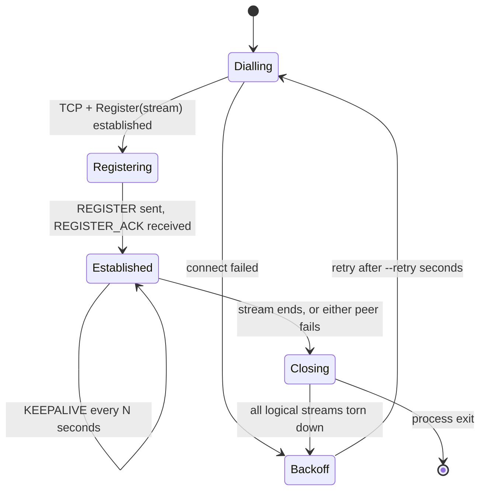
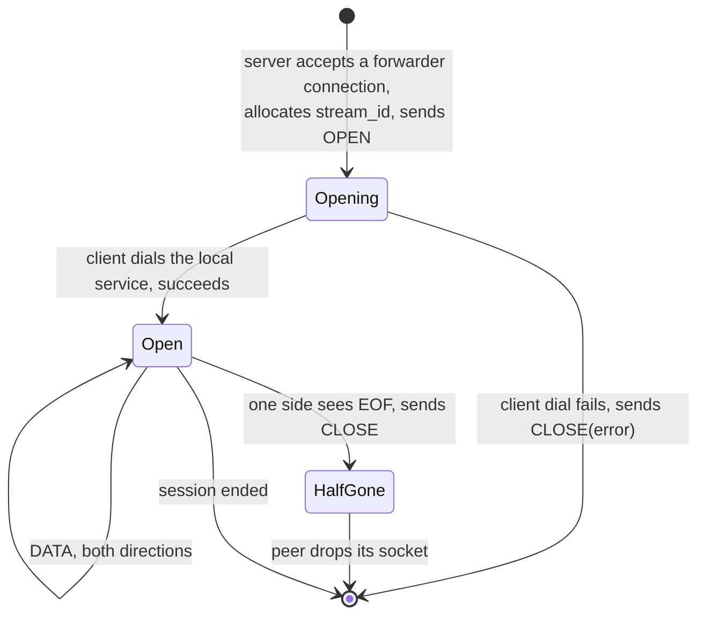

# grpc-tunnel protocol specification

Version 1. Defines the wire protocol between `tunnel-client` and
`tunnel-server` in this directory. The normative source is
[`proto/tunnel.proto`](proto/tunnel.proto); where this document and the proto
disagree, the proto wins.

`MUST` / `SHOULD` / `MAY` are used as in RFC 2119.

---

## 1. Terminology

| term | meaning |
|---|---|
| **tunnel client** | the peer that *dials*. Runs where there is no inbound reachability. |
| **tunnel server** | the peer that *accepts*. Runs where a stable address exists. |
| **session** | one `Tunnel/Register` call. One session == one tunnel. |
| **logical stream** | one spliced TCP connection carried inside a session, identified by `stream_id`. |
| **target** | a name a tunnel client registers under, used by the server to select a session. |
| **payload** | the bytes a logical stream carries. Opaque to this protocol. |

Note the inversion that motivates the whole design: the **tunnel client** is
the TCP *initiator* but the RPC *responder*. The **tunnel server** is the TCP
*responder* but the RPC *initiator*.

---

## 2. Transport

A session is a single bidirectional gRPC stream:

```proto
service Tunnel {
    rpc Register(stream Frame) returns (stream Frame);
}
```

* The tunnel client MUST be the one to invoke `Register`.
* The call is long-lived; it is held open for the life of the tunnel and
  carries every logical stream multiplexed together.
* Transport security is out of scope for v1 — see §9.

Because gRPC permits only one in-flight `Write` per stream, every
implementation MUST serialise writes to the session. In this implementation
that is `Session::Send`, guarded by a mutex (`src/session.cc`).

---

## 3. The frame

Every message in both directions is a `Frame`.

```proto
message Frame {
    uint64 stream_id = 1;
    Type   type      = 2;
    bytes  data      = 3;
    string target    = 4;
    string error     = 5;
}
```

### 3.1 Field use by type

`—` means the field MUST be unset (proto3 default) and MUST be ignored by a
receiver if present.

| `type` | direction | `stream_id` | `data` | `target` | `error` |
|---|---|---|---|---|---|
| `REGISTER` | client → server | — | — | **required** | — |
| `REGISTER_ACK` | server → client | — | — | echoed | — |
| `OPEN` | server → client | **required** | — | **required** | — |
| `DATA` | either | **required** | **required** | — | — |
| `CLOSE` | either | **required** | — | — | optional |
| `KEEPALIVE` | client → server | — | — | — | — |

`UNKNOWN` (0) MUST NOT be sent. A receiver MUST ignore frames whose `type` it
does not recognise, rather than failing the session — this is the forward
compatibility rule for adding frame types later.

### 3.2 `stream_id`

* Allocated **only by the tunnel server**, because only the server opens
  logical streams. This removes any need for a split id space or collision
  rule between the peers.
* Starts at 1 and increments by 1 per `OPEN` within a session
  (`Session::NextStreamId`).
* Scoped to its session. Ids are not reused within a session and carry no
  meaning across sessions.
* `stream_id = 0` is reserved for session-wide frames (`REGISTER`,
  `REGISTER_ACK`, `KEEPALIVE`).

---

## 4. Session lifecycle



### 4.1 Establishment and registration

1. The client opens a TCP connection to the server's listen address and
   invokes `Register`.
2. The client MUST send `REGISTER` with `target` set, as the first frame.
3. The server records `target → session` in its registry and replies
   `REGISTER_ACK`.
4. The server MUST NOT route any logical stream to a session before its
   `REGISTER`. Until then a forwarder connection is refused (§6.4).

A second `REGISTER` on the same session replaces the target binding. If two
sessions register the same target, the later registration wins; the earlier
session stays open but becomes unroutable.

**What is advertised, and what is configured.** Only the client advertises: a
`target` is a claim the client makes at dial-in. The server advertises nothing.
Its forwarder endpoint is static operator configuration (`--target`), bound at
startup *before* any client has registered, and a connection to it is refused
until a matching session appears. An implementation MAY instead create
endpoints dynamically on registration; this one does not.

When a session ends, the server MUST remove its registry entry **only if that
entry still points at this session** — a client that reconnects quickly can
register again before the previous handler has finished unwinding, and an
unconditional delete would erase the new session's entry.

### 4.2 Keepalive

The client SHOULD send `KEEPALIVE` on an interval (default 20s, `--keepalive`)
so NAT and load-balancer flow state does not expire on an idle tunnel. The
server MUST accept and ignore it. No response is defined; liveness in the other
direction is gRPC's concern.

### 4.3 Teardown

When a session ends for any reason, both peers MUST tear down every logical
stream belonging to it. Logical streams do not survive their session, and
`stream_id`s are not resumable — a reconnecting client starts from an empty
table and the server allocates from 1 again.

---

## 5. Logical streams



### 5.1 Opening

The server allocates a `stream_id`, registers the accepted socket against it,
then sends `OPEN` carrying that id and the target. It MAY begin sending `DATA`
for that id immediately; it MUST NOT wait for an acknowledgement, and none is
defined.

The client, on `OPEN`, dials its local service and binds the resulting socket
to `stream_id`. This dial MUST happen before any subsequent frame for that id
is processed — see the ordering rule in §7.

### 5.2 Data

* `DATA.data` is opaque. Implementations MUST NOT interpret, reframe on
  content, or rewrite it.
* Payload is chunked at 32 KiB per frame (`kChunk`, `src/session.cc`). The
  chunk boundary carries no meaning: a receiver MUST treat the concatenation of
  a stream's `DATA` payloads as a byte stream, not as records.
* Frames for a given `stream_id` MUST be delivered to the socket in the order
  received. Frames for *different* ids MAY interleave arbitrarily.

### 5.3 Closing

`CLOSE` means "this `stream_id` is finished at my end". A peer receiving it
MUST drop its socket for that id and MUST NOT send further frames for it.

* `error` empty — normal end of stream (EOF on the spliced socket).
* `error` set — the stream failed; the text is diagnostic only and carries no
  defined machine-readable meaning.

Close is **not** acknowledged and is **not** half-duplex: there is no
`CLOSE`-for-one-direction. A stream ends for both directions at once. This is a
simplification over TCP's independent half-close, and is adequate because gRPC
channels close both directions together.

**Simultaneous close.** Both ends may send `CLOSE` for the same id at
effectively the same moment, and a `DATA` frame may cross a `CLOSE` in flight.
Neither is an error. An implementation MUST therefore:

* treat `CLOSE` for an unknown `stream_id` as a no-op, and
* answer `DATA` for an unknown `stream_id` with a plain `CLOSE` carrying **no**
  `error` — the stream is already gone at this end, and nothing has gone wrong.

Reporting these as failures produces false errors under entirely normal
traffic; this implementation returns a found/not-found flag from
`Session::CloseConn` precisely so it can tell the two cases apart.

---

## 6. Frame flow

### 6.1 One unary RPC, end to end

`C` = tunnel client, `S` = tunnel server. Session already established.

| # | who | frame | what it corresponds to |
|---|---|---|---|
| 1 | app | — | gRPC channel dials the forwarder's TCP port |
| 2 | S | `OPEN id=1 target=edge-1` | forwarder accepted, id allocated |
| 3 | C | — | dials the local service; socket bound to id 1 |
| 4 | S | `DATA id=1` | HTTP/2 client preface + SETTINGS |
| 5 | C | `DATA id=1` | server SETTINGS + ACK |
| 6 | S | `DATA id=1` | HEADERS (`:path = /echo.Echo/Say`) + DATA |
| 7 | C | `DATA id=1` | HEADERS + DATA + trailers (`grpc-status`) |
| 8 | app | — | the stub returns; channel stays open |

Steps 4–7 are **not** interpreted by either peer. The tunnel sees byte
buffers; that they happen to be HTTP/2 frames carrying a gRPC call is invisible
to it, which is precisely why deadlines, status codes, trailers and
compression all work without support here.

### 6.2 Streaming RPCs

No difference at the frame level. A server-streaming call simply produces more
`DATA` frames from `C` over a longer period (steps 7a, 7b, …) before the
trailers arrive. The tunnel needs no streaming-specific handling because it
never knew the difference.

### 6.3 Channel reuse

A gRPC channel is long-lived, so steps 1–3 happen **once per channel**, not per
RPC. Subsequent calls reuse `id=1` and appear as more `DATA` in both
directions. Observed directly in `--auto` mode: four RPCs, one `OPEN`.

### 6.4 Concurrency and interleaving

Two concurrent channels produce two ids, and their frames interleave on the one
session:

```
S → C   OPEN id=1
S → C   DATA id=1      (call A request)
S → C   OPEN id=2
S → C   DATA id=2      (call B request)
C → S   DATA id=2      (call B reply — B may finish first)
C → S   DATA id=1      (call A reply)
C → S   CLOSE id=2
```

Ordering is guaranteed **per id**, never across ids.

### 6.5 Failure cases

| case | frames | result |
|---|---|---|
| no session registered for target | none | server refuses the forwarder connection at accept; the app's dial fails locally |
| client cannot reach its local service | `C → S  CLOSE id=N error="local dial failed"` | app sees the connection drop; gRPC surfaces `UNAVAILABLE` |
| write to local socket fails | `CLOSE id=N error="local write failed"` | as above |
| `DATA` for an unknown id | `CLOSE id=N` (no error) | peer drops the stream quietly |
| session lost | none | both peers tear down every id; the client re-dials after `--retry` |

---

## 7. Ordering and concurrency (normative)

1. **Writes to the session MUST be serialised.** gRPC allows one in-flight
   write per stream.
2. **Frames MUST be processed in receive order.** In this implementation the
   receive loop applies each frame inline — including the local dial on `OPEN`
   — so an `OPEN` is fully applied before the `DATA` behind it. An
   implementation that dispatches frames to worker threads MUST re-establish
   per-id ordering some other way.
3. **Per-id ordering is guaranteed; cross-id ordering is not.**
4. **A socket's fd MUST NOT be closed while another thread may read it.** Here:
   tearing a stream down `shutdown()`s the socket to wake its reader, and the
   `close()` happens in `~Conn` once both the stream table and the reader have
   released their reference.
5. **A session object MAY outlive the RPC handler that created it** (detached
   reader threads hold references). Since the underlying stream pointer does
   *not*, an implementation MUST fence writes at handler exit —
   `Session::Shutdown` takes the same mutex `Send` does, so it cannot complete
   while a write is in flight, and every later `Send` fails instead of touching
   a dangling pointer.

---

## 8. Flow control

There is none at this layer, by omission rather than by design.

The inner HTTP/2 session still applies its own per-stream flow control end to
end, and gRPC's own windows bound a single call. What is missing is
backpressure *between* the layers: a slow local socket is absorbed by kernel
buffers and by the outer gRPC stream's window rather than being signalled to
the far peer. At demo volumes this is invisible. A production version would add
a windowed `DATA` credit per `stream_id`, which is the main thing v1 leaves
out.

---

## 9. Security considerations

v1 is **not** secure and MUST NOT be exposed to an untrusted network as-is.

* **No transport security.** Both ends use insecure credentials. Deployments
  SHOULD use mTLS on the `Register` call.
* **No authentication of `REGISTER`.** `target` is an unverified claim; any
  peer that can reach the port can register any name, including one already in
  use, and take over its routing. The server SHOULD derive the target from an
  authenticated client identity (e.g. a certificate SAN) rather than from the
  frame.
* **The tunnel is an inbound path into the client's network.** Anything the
  client can dial, the server can reach. The client SHOULD constrain what a
  logical stream may connect to — here, the fixed `--echo` address.
* **`error` strings cross a trust boundary** and SHOULD NOT carry internal
  detail.

One property works in the deployer's favour. Because the tunnel relays payload
bytes without decoding them (§5.2), an application protocol MAY run its own TLS
*end to end through* the tunnel, and the tunnel cannot read that session. This
also blunts `REGISTER` spoofing: a hostile registration can hijack routing, but
the application client's certificate check then fails against the wrong peer,
so the attack degrades from silent interception to denial of service. This is a
mitigation, not a substitute for §9's first two bullets.

---

## 10. Non-goals

* Half-close, stream priorities, or flow control (§8).
* Resumption: streams do not survive a session.
* More than one target per forwarder. The registry is keyed by name and holds
  many sessions, but a plain TCP `accept()` carries no routing information, so
  the target has to be bound to the listener. Reaching a second target needs a
  second listener.

  In fleet terms this is the sharpest limit in v1: *N* devices means *N*
  forwarder ports, allocated in advance, with the operator maintaining the
  device → port mapping by hand. The tunnel side already scales — the registry
  holds many sessions — so what is missing is creating an endpoint when a
  device registers, or carrying the target somewhere other than "which port you
  connected to". Note that the obvious fix, reading the target from the
  payload's metadata or `:authority`, would require parsing the inner protocol
  and forfeit §10's last bullet.
* Interpreting the payload. The tunnel is protocol-agnostic and carries any
  TCP-based protocol, not only gRPC.

---

## 11. Prior art and further reading

* **[openconfig/grpctunnel](https://github.com/openconfig/grpctunnel)** — the
  closest production relative: TCP over gRPC, in Go, used for dial-in to
  network devices. Its
  [`tunnel.proto`](https://github.com/openconfig/grpctunnel/blob/master/proto/tunnel/tunnel.proto)
  splits the job across **two** RPCs — `Register(stream RegisterOp)` for
  control and a separate `Tunnel(stream Data)` **per connection**, correlated by
  an `int32 tag`. This specification instead multiplexes every connection onto
  the single `Register` stream and keys them by `stream_id`. Theirs isolates
  connections (one slow stream cannot head-of-line block another) at the cost
  of an RPC per connection; this one is simpler and cheaper per connection but
  shares one stream's ordering and window. It also supports target
  subscriptions and registration from either side, which v1 here does not.
* **[RFC 4254 §7.1](https://datatracker.ietf.org/doc/html/rfc4254#section-7.1)**
  — SSH `tcpip-forward`. The original reverse port forward, and the same
  inversion of dial direction.
* **[RFC 9113 §5](https://www.rfc-editor.org/rfc/rfc9113#section-5)** — HTTP/2
  streams and multiplexing. The model `stream_id` imitates, including why
  per-stream ordering and cross-stream independence are stated separately.
* **[gRPC over HTTP/2](https://github.com/grpc/grpc/blob/master/doc/PROTOCOL-HTTP2.md)**
  — what is actually inside the `DATA` frames.
* [`README.md`](README.md) — diagrams of both phases, and how to run it.
